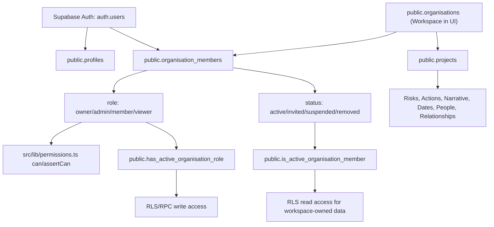
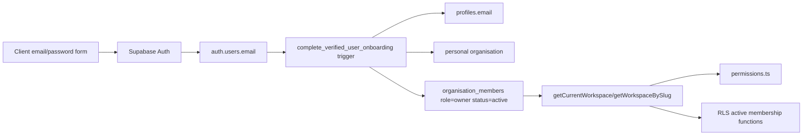

# WT-WORKSPACE-TEAM-001 Membership and Identity Model Assessment

**Status:** Technical assessment for WT-WORKSPACE-TEAM-001
**Date:** 22 July 2026
**Related epic:** WT-WORKSPACE-TEAM-ACCESS-EPIC-001 Workspace Team Administration and Access Lifecycle
**Evidence base:** Supabase migrations, authentication components, application helpers, tests and architecture docs in this repository. External Supabase references are linked only where platform behaviour needs confirmation.

## WT-WORKSPACE-TEAM-002 Implementation Note

WT-WORKSPACE-TEAM-002 implements the database foundation recommended by this assessment. The migration `20260722000100_workspace_membership_lifecycle_audit_schema.sql`:

- adds `first_name`, `last_name`, `login_name` and `contact_email` to `profiles` without changing the current email/password login journey;
- migrates legacy `organisation_members.status = 'removed'` to the product-facing `deactivated` state;
- constrains membership states to `invited`, `invite_expired`, `active`, `suspended` and `deactivated`;
- adds lifecycle timestamps, actors and reasons for invitation expiry, activation, suspension, deactivation and reactivation;
- adds controlled lifecycle functions and profile identity correction functions that use real stored active membership roles rather than internal role simulation;
- adds final-active-Owner, Admin-vs-Owner/Admin and self-deactivation/suspension safeguards;
- adds `workspace_member_directory` and `workspace_member_admin_directory` for scoped identity display;
- adds append-only `workspace_membership_audit_events`;
- adds CSV administration foundation tables for later export/import slices.

WT-WORKSPACE-TEAM-002 does not implement invitation delivery, Supabase Auth user creation, CSV generation/parsing/apply behaviour, login-name authentication, shared-contact-email authentication, reassignment actions or Workspace Team UI.

## WT-WORKSPACE-TEAM-003 Implementation Note

WT-WORKSPACE-TEAM-003 adds a read-only Workspace Team page at `/app/workspaces/{workspaceSlug}/team` and links it from the authenticated workspace-level navigation when an active workspace can be resolved.

The page keeps the WT-WORKSPACE-TEAM-001/002 identity separation intact:

- access comes from the current user's active workspace membership loaded through the existing workspace slug helpers;
- general directory display uses `workspace_member_directory`;
- Owner/Admin users can use `workspace_member_admin_directory` for administration-oriented lifecycle fields;
- contact email and auth email are not rendered by this slice;
- rows are keyed by `organisation_membership_id` and `profile_id`, not by email;
- deactivated memberships remain visible for history but are rendered as neutral inactive rows;
- role and membership-state values are mapped to product labels before display, including `invite_expired` as `Invitation expired`.

The page includes disabled future controls for `Download team CSV for update` and `Membership history`. WT-WORKSPACE-TEAM-003 does not implement mutations, CSV export/import processing, invitation delivery, shared-email authentication, login-name authentication or service-role access.

## WT-WORKSPACE-TEAM-004 Implementation Note

WT-WORKSPACE-TEAM-004 turns the Workspace Team CSV control into a server-side export and advisory checkout flow.

The slice adds:

- `workspace_membership_export_rows` to preserve the exact normalised rows included in each export;
- `export_mode` on `workspace_membership_export_runs` with `editable` and `read_only` values;
- `current_workspace_membership_snapshot_version`, a deterministic membership snapshot hash;
- `create_workspace_membership_csv_export`, a security-definer function that checks the real active Owner/Admin role, serialises editable export creation with a workspace advisory transaction lock, records snapshot rows, starts a 24-hour checkout for editable exports, and handles takeover/supersession;
- `/app/workspaces/{workspaceSlug}/team/export`, a POST-only download endpoint that returns the CSV generated from the persisted snapshot;
- page-level checkout visibility, read-only download and takeover confirmation.

The CSV `email` column is `profiles.contact_email`, not the Supabase authentication email mirror. Existing people continue to be identified by `workspace_membership_id` and `user_id` UUIDs. Read-only exports are auditable but cannot become an editable upload source. Superseded editable exports are retained for history and made ineligible for later upload by status and supersession metadata.

WT-WORKSPACE-TEAM-004 does not implement CSV upload, parsing, comparison, approval, apply behaviour, invitation delivery, membership mutation, profile correction UI, role editing, Supabase Auth account creation, shared-email login or password-flow changes.

## 1. Executive Conclusion

Watchtower already has a usable workspace-first foundation:

- Supabase Auth owns authentication identities in `auth.users`.
- `public.profiles` mirrors a verified auth user for display and audit metadata.
- `public.organisations` is the database workspace table.
- `public.organisation_members` links users to workspaces with fixed roles and lifecycle status.
- Most workspace-owned RLS policies use `public.is_active_organisation_member` or `public.has_active_organisation_role`, both of which require `organisation_members.status = 'active'`.
- Application routing and helper code also filters current workspace selection to active memberships.

The foundation can support the Workspace Team Administration epic, but not without schema and access-control extension in later slices. The material gaps are:

- Authentication email, login email and profile email are currently the same value in registration, login, reset and onboarding.
- `profiles` has only one `email` and `display_name`, with no `login_name`, first name, last name or separate contact email.
- `organisation_members.status` supports `active`, `invited`, `suspended` and `removed`, but invitation acceptance, expiry, deactivation timestamp, reactivation timestamp and CSV audit history are not implemented.
- Existing direct membership updates have only basic Owner-row protection and do not yet encode final-owner, self-deactivation or Admin-vs-Owner CSV rules.
- `profiles` RLS permits users to read only their own profile. Existing enrichment code catches profile-read failures and falls back to generic labels, which is acceptable for current MVP screens but insufficient for a team administration page or historical person display.
- Sessions are invalidated indirectly by active-aware RLS. Existing access tokens remain technically valid until expiry, so immediate access removal depends on every data path checking active membership.

Recommended direction:

- Keep Supabase Auth as the authentication identity provider.
- Treat `auth.users.id` as the immutable authentication identity.
- Keep `profiles.id = auth.users.id`, but extend profile/person data to separate login identifier, contact email and display/person fields.
- Keep `organisation_members.id` as the immutable workspace-membership key and make membership lifecycle state explicit.
- Route all role and access decisions through active membership and central permission helpers.
- Add a database-level membership lifecycle/audit foundation before CSV import/export.

Shared-email recommendation:

**Supported with a bounded architectural extension.** Standard Watchtower currently cannot support multiple distinct real users sharing the same Supabase Auth email because the app signs up, signs in and resets passwords by email. Supabase Auth documentation describes email/password sign-in as password authentication tied to an email or phone, identity linking depends on unique email, and admin invite/link generation is email-address based. The least disruptive path is to keep every real auth account on a unique authentication email and introduce a separate contact email in Watchtower profile/person data. For the one internal workspace, use unique synthetic auth emails plus unique `login_name` values if shared notification/contact delivery remains worth the operational complexity. The current demo-persona feature is safer for most testing because it avoids creating real auth accounts.

Blockers before WT-WORKSPACE-TEAM-002:

- Decide whether `removed` is the final product term or whether the UI-facing term `deactivated` should map to a DB status value or timestamp.
- Add lifecycle/audit fields and Owner/Admin protections before exposing membership CSV operations.
- Add active-member profile visibility or a membership/person view before building team export and historical displays.
- Confirm the chosen shared-email mechanism against the target Supabase project before committing to real shared-contact auth journeys.

## 2. Current Architecture Map

Current real flow:

1. Browser auth forms call Supabase Auth through `src/lib/supabaseClient.ts`.
2. `src/components/auth/RegisterForm.astro` calls `supabase.auth.signUp({ email, password })`.
3. `supabase/migrations/20260614000600_create_auth_onboarding.sql` creates profile, default personal workspace, Owner membership, settings and audit rows after `auth.users.email_confirmed_at` is present.
4. Server-side pages use `src/lib/supabaseServer.ts` to create an anon-key Supabase client with the user's JWT from `wt-access-token`.
5. `src/lib/projects.ts` loads the current workspace from `organisation_members` with `.eq('status', 'active')`.
6. UI permissions use `src/lib/permissions.ts`.
7. Database access is enforced by RLS policies in migrations. Workspace-owned policies generally call `is_active_organisation_member` for reads and `has_active_organisation_role` for writes.
8. Internal test role/persona simulation can override the effective role only for the scoped Mark.Nesbit.Professional workspace through `public.active_internal_role_simulation` and `src/lib/internalTesting.ts`.

## 3. Current Schema Inventory

| Object | Purpose and important fields | Keys, constraints and audit | RLS position | Application usage | Recommendation |
| --- | --- | --- | --- | --- | --- |
| `auth.users` | Supabase-owned auth identity. Email is the current sign-up, sign-in and reset identifier. | Supabase-managed `id`, `email`, credentials and session metadata. Referenced by public tables. | Outside public schema. JWT claims drive `auth.uid()`. | Auth forms, onboarding trigger, server session checks. | Reuse. Do not manually mutate except through Supabase Admin APIs in future server-only invitation flows. |
| `public.profiles` | Lightweight account profile: `id`, `email`, `display_name`, `avatar_url`, `last_login_at`, `is_internal_tester`, audit fields. | PK `id` references `auth.users(id)`. Email/display name non-empty. `is_internal_tester` added by WT-TEST-001. `on delete cascade` currently follows auth deletion. | User can select only own profile. Internal helper `is_internal_tester` reads it as security definer. | App landing, feature flags, display enrichment for project people/risks/actions/narrative/dates. | Extend. Add person/contact fields or a companion person table. Review `on delete cascade` if historical identity must survive auth soft deletion. |
| `public.organisations` | Workspace table in database language: `name`, `slug`, `type`, archive/delete fields. | PK `id`, unique `slug`, `created_by`, timestamps. | Active members can read. Owners/Admins update. Owner-only trigger guards archive/delete. | Workspace routing, current workspace selection, projects. | Reuse. Add immutable internal setting/identifier for special workspaces rather than relying on editable name. |
| `public.organisation_members` | Workspace membership: `organisation_id`, `user_id`, `role`, `status`, `invited_by`, `invited_at`, `joined_at`. | PK `id`, unique `(organisation_id, user_id)`, role check `owner/admin/member/viewer`, status check `active/invited/suspended/removed`, active lookup index. | Active members can read all memberships in workspace. Owners/Admins can update non-owner memberships. | Current workspace selection, role resolution, RLS helpers, project person/action/risk assignment options. | Extend. Add lifecycle timestamps, CSV fields, audit constraints, final Owner protection and controlled RPCs. |
| `public.organisation_settings` | Workspace settings including `default_member_role`, member project/data controls, MFA flag. | PK/FK `organisation_id`; default member role excludes Owner. | Active members read; Owners/Admins update. | Member project creation checks. | Reuse and extend if shared-contact-email or team import settings need immutable flags. |
| `public.feature_flags` | Global and workspace feature availability. | Unique global/workspace keys. | Authenticated users read enabled global flags; active members read enabled workspace flags. | `src/lib/featureFlags.ts`. | Reuse. Not a membership source. |
| `public.audit_log` | General audit log: workspace, actor, action, entity, old/new values. | PK `id`, optional `organisation_id`, `actor_user_id`, timestamp. | Owners/Admins read workspace logs; users read own account logs. Limited insert policy for project creation. | Auth audit RPC, onboarding, project creation. | Extend. Add membership CSV import events and actor/target metadata conventions. |
| `public.projects` | Workspace-owned projects. | FK `organisation_id`, unique workspace slug/ref, creator, archive/delete fields, immutable scope triggers. | Active members read; Owner/Admin/eligible Member create/update. | Project list, project detail, risks/actions/narrative/date routes. | Reuse. Later restricted-project visibility requires extra policy dimension. |
| `public.project_risks` and `public.project_risk_notes` | Project risks and threaded risk notes. Owners/actioners are profile/user IDs. | Workspace/project composite FKs; lifecycle/status checks; audit fields and immutable scope triggers. | Active members read; Owners/Admins/Members create/update. | `src/lib/projectRisks.ts` and risk pages. | Reuse. Extend responsibility checks to flag deactivated owners/actioners without deleting history. |
| `public.project_actions`, `public.project_action_history`, `public.project_action_counters` | Project action workflow and immutable history. Actioner, raiser and acceptance owner reference profiles. | Composite workspace/project FKs, immutable identity trigger, status checks, append-only history for non-service role. | Active members read actions/history. Writes are through security-definer RPCs, not direct authenticated table writes. | `src/lib/projectActions.ts` and action pages. | Reuse. Extend reassignment detection and active-person eligibility reporting. |
| `public.project_people` | Project responsibility assignment. Can reference a real `auth.users.id` or a demo persona. | Exactly one of `user_id` or `demo_person_id`. Status `active/removed`. Insert/update trigger validates active workspace member or active demo person. | Active members read; Owners/Admins/Members create/update. | Project Details people controls and dashboard signals. | Reuse. Add inactive-member presentation and reassignment checks. |
| `public.project_dates` and `public.project_date_comments` | Timeline/setup dates and comments. | Workspace/project FKs, soft `removed_at`, audit trigger. | Active members read. Owners/Admins/Members write dates. Comments can also be added by active project participants. | Project Details, Timeline and dashboard signals. | Reuse. Participant comment policy still depends on active workspace membership through overall RLS and project_people membership checks. |
| `public.project_narrative_entries`, `public.project_narrative_entry_links`, `public.project_narrative_read_states` | Narrative entries, links and per-user read-state. | Generated project refs, immutable identity fields, user/project read-state uniqueness. | Active members read entries/links. Owners/Admins/Members write entries/links. Read states require current user and active membership. | Narrative pages and dashboard awareness. | Reuse. Add historical author display support via profile/person visibility. |
| `public.project_relationships` | Workspace/project-scoped relationships. | Workspace/project FKs, audit/scope triggers. | Active members read; Owners/Admins/Members write/delete. | Project relationship helpers and tests. | Reuse. No team-specific change expected. |
| `public.workspace_demo_people` | Internal demo personas, not auth users. Has `display_name`, `email`, `notification_email`, `workspace_role`, `project_role`, flags, status and optional `linked_profile_id`. | Scoped by organisation; active demo email unique per workspace; `workspace_role` excludes Owner; `is_demo_person = true`; audit fields. | Internal testers only, active member, scoped workspace only. | Account Test tools, demo persona simulation, project_people options. | Reuse for test modelling. Do not treat as customer identity or invitation implementation. |
| `public.internal_role_simulations` | Internal effective-role/persona simulation. | `user_id`, `organisation_id`, `simulated_role`, `demo_person_id`, active/expiry fields. One active simulation per user/workspace. | Internal tester, scoped workspace, active membership. | `src/lib/internalTesting.ts`, Account Test tools, banner. | Reuse only for internal testing. Not a customer admin model. |
| `public.is_active_organisation_member` | Active-membership boolean helper. | Security definer, stable, checks `om.status = 'active'`. | Used directly by RLS. | Foundation and later policies. | Reuse. Keep as the read-access source of truth. |
| `public.has_active_organisation_role` | Role helper with active membership. Later redefined to honour internal role simulation. | Security definer, stable, checks active membership and effective role. | Used by RLS and triggers/RPCs. | Foundation policies, project policies, action RPCs. | Reuse. Any future permission complexity should layer after this. |
| Action lifecycle RPCs | `create_project_action`, `submit_project_action`, `return_project_action_to_raiser`, `reject_project_action`, `return_project_action_to_actioner`, `complete_project_action`, `cancel_project_action`, `assign_project_action`, `amend_project_action_brief`, `change_project_action_due_date`, `reissue_project_action`, `take_over_project_action_acceptance`, `save_project_action_progress`. | Security-definer functions derive actor from `auth.uid()`, lock rows, validate expected state and insert history. | Execute grants to authenticated; internal helpers also to service role. | Action screens. | Reuse. Maintain actor active-membership checks before allowing workflow changes. |
| Onboarding functions/triggers | `derive_display_name_from_email`, `slugify_workspace_name`, `unique_workspace_slug`, `complete_verified_user_onboarding`, `record_auth_audit_event`. | Security-definer trigger on `auth.users` after insert/update of `email_confirmed_at`; audit RPC allowlist. | Not RLS policies, but write app records. | Auth registration/login/logout/reset audit. | Extend carefully for invited users and existing-user workspace invitations. |

## 4. Authentication Assessment

Current registration:

- `src/components/auth/RegisterForm.astro` collects `email` and `password`, derives display name from the email, and calls `supabase.auth.signUp`.
- `supabase/config.toml` has email auth enabled and `enable_confirmations = true`.
- `complete_verified_user_onboarding` runs only when `new.email_confirmed_at` is not null. It inserts or updates `profiles`, creates a personal workspace, creates active Owner membership and inserts audit events.

Current login:

- `src/components/auth/LoginForm.astro` labels the login field as Email and calls `supabase.auth.signInWithPassword({ email, password })`.
- A successful login writes `wt-access-token` and `wt-refresh-token` cookies for server-rendered routes.
- Failed login returns a generic message.

Email verification:

- The onboarding trigger prevents application records from being created before email confirmation.
- The register form sends users to `/login` after verification.

Password setup/reset:

- `ForgotPasswordForm.astro` calls `supabase.auth.resetPasswordForEmail(email)`.
- `ResetPasswordForm.astro` calls `supabase.auth.updateUser({ password })`.
- `record_auth_audit_event` records reset request/completion when called, but `profiles.last_login_at` is not currently updated by the login audit path.

Invitations:

- The database has early fields `organisation_members.invited_by` and `invited_at`, and settings have `default_member_role`.
- There is no implemented customer invitation flow, no use of `supabase.auth.admin.inviteUserByEmail`, no invite acceptance table and no invitation expiry field.
- Supabase admin invitation APIs are server-only because they require privileged admin access. The Supabase JavaScript reference documents `inviteUserByEmail` and warns that admin user-management functions require server-side `service_role` handling.

Existing-user multi-workspace behaviour:

- The schema supports it: `organisation_members` has unique `(organisation_id, user_id)`, not unique `user_id`.
- The application already fetches memberships by active status and can theoretically select workspaces by slug.
- No implemented UI exists for inviting an existing user into a second workspace.

Session handling:

- Protected data access is controlled by JWT-backed Supabase clients and RLS.
- `SignOutButton.astro` calls `supabase.auth.signOut()` and clears local cookies.
- Supabase documentation states that server-side session revocation can revoke refresh tokens, but access-token JWTs cannot be revoked before expiry. Therefore membership deactivation must immediately change RLS results, and future admin deactivation should also revoke refresh tokens where possible.

Email-as-identity assumptions:

- Confirmed current behaviour ties auth identity, login name and password reset destination to one email field.
- `profiles.email` is copied from `auth.users.email`.
- Display names are derived from email in both client and database helpers.
- Assignment and ownership records use immutable user/profile IDs, not email, which is a strong foundation.
- Demo personas have `email` and `notification_email`, but they are not auth identities.

## 5. Permission and RLS Assessment

Existing permission helpers:

- `src/lib/permissions.ts` defines fixed roles and a central `can`/`assertCan` mapping.
- Viewer is read-only for project, risk, narrative and action write permissions.
- `src/lib/projects.ts` is the main workspace resolver and always loads current/slugged memberships with `.eq('status', 'active')`.
- Domain helpers such as `projectPeople.ts`, `projectRisks.ts`, `projectActions.ts`, `projectDates.ts` and `projectNarrative.ts` call `assertCan`/`can` after workspace resolution.

Source of truth:

- Database source of truth is active `organisation_members` plus role.
- Application source of truth is the active membership returned by `getCurrentWorkspace` or `getWorkspaceBySlug`.
- Profiles are not permission records.

RLS active-membership status:

- Foundation policies for `organisations`, `organisation_members`, `organisation_settings`, workspace feature flags and audit logs use active-aware helpers.
- Projects, risks, risk notes, project people, project dates, project date comments, project relationships, narrative entries, narrative links, narrative read-states and actions all have active-member read checks or active-role write checks.
- Action lifecycle RPCs explicitly check active Owners/Admins/Members for creation, assignment and workflow roles.
- `project_people.validate_project_people_assignment` requires an active workspace member when creating or keeping an active real-person assignment.

Current Owner protections:

- Organisation archive/delete is Owner-only via `prevent_non_owner_organisation_destructive_update`.
- `organisation_members` update policy blocks updates where the row role is Owner.
- This is not yet enough for CSV administration because it does not cover final active Owner preservation, Admin attempts to demote/remove Owner through controlled import, or self-deactivation rules.

Current Viewer enforcement:

- Application helper denies write permissions for Viewer.
- RLS write policies and action RPCs require Owner/Admin/Member, not Viewer.
- UI commonly keeps restricted controls visible with disabled explanatory text, for example Projects and Risks screens.

Duplicated or inconsistent permission logic:

- The role-to-permission mapping is central in TypeScript, but domain helpers repeat some eligibility checks locally, especially member project creation settings and project participant comment checks.
- Database policies are consistent in active-aware membership checks, but each domain encodes its own allowed roles.
- Action workflow has dedicated RPC helpers, which is appropriate because it needs transaction and state checks.

Security-definer and service-role risks:

- Security-definer functions consistently set `search_path = public`.
- Service role has broad grants across tables and can bypass normal RLS. There is no service-role key in browser code.
- Future invitation, CSV import and session revocation work must stay server-only.

RLS gaps and risks:

- `profiles` visibility is too narrow for team administration and historical display. Current fallback behaviour avoids crashes but does not satisfy a membership export/person-display requirement.
- The active-member posture is strong for existing workspace-owned data, but every new membership/import/admin table must follow the same pattern before soft deactivation is safe.
- Session revocation cannot be the only deactivation control because active access tokens may continue until expiry.
- The current `organisation_members` update policy allows Owners/Admins to update non-owner membership rows directly where column grants permit it. Future lifecycle changes should move membership administration to controlled RPCs or narrow grants.

## 6. Shared-Email Feasibility Decision

Primary conclusion: **Supported with a bounded architectural extension.**

Current design: not supported. The current login, signup and password reset screens all use email as the Supabase Auth identifier. Standard Supabase email/password and email-link flows are email-address based, and Supabase identity linking relies on unique emails. The current repository has no `login_name` field and no login-name-to-auth lookup.

Recommended model:

- **Auth identifier:** unique Supabase Auth email for every real account. For the internal shared-contact workspace only, this may be a synthetic email such as `john.smith.01+watchtower-test@owned-domain.example`, not the shared contact email.
- **Login name:** add immutable or tightly controlled `login_name` in Watchtower profile/person data, unique per auth user. Login name should resolve server-side to one auth email only after validating that the workspace is the authorised internal workspace.
- **Contact email:** add a separate `contact_email` outside `auth.users.email`. General workspaces require unique contact email per person unless deliberately relaxed later. The internal workspace may allow duplicate contact emails.
- **Login journey:** normal users continue email/password login. Internal test personas may enter `login_name` plus password; the server resolves `login_name` to the synthetic auth email and then uses Supabase password auth. Do not allow shared contact email to select a persona.
- **Invitation journey:** create/invite auth accounts with unique synthetic auth emails, but send operational invite notifications to the shared contact email through Watchtower-controlled mail/audit flow. Native Supabase invite emails are tied to the auth email unless a custom delivery flow is implemented.
- **Password reset journey:** password reset must be persona-specific. A user must identify the `login_name`; Watchtower sends or generates the recovery route for the matching synthetic auth email to the shared contact destination only after the internal-workspace restriction passes.
- **Identity-selection rules:** UUIDs and `login_name` select identity. Shared contact email never selects identity. CSV reactivation must require membership UUID or an explicit former-person choice.
- **Audit treatment:** all records continue to store `auth.users.id`/`profiles.id` and `organisation_members.id`; audit display may show login name and contact email, but audit identity remains UUID based.
- **Workspace restriction:** do not bind to editable workspace name. Current internal tools use slug `mark-nesbit-professional-workspace`; this is better than name but still mutable in principle. Later slices should add an immutable setting or explicit internal workspace id allowlist.
- **Security controls:** server-only lookup, rate limiting, clear operator audit, no client-side service-role key, no customer-workspace enablement, and explicit tests proving shared contact email cannot authenticate or reset by itself.

Alternative decision:

- If this complexity is not worth it, replace shared-email real accounts with the existing `workspace_demo_people` persona simulation. That is the safer MVP test method because demo people already preserve separate persona IDs and roles without creating real auth users, invitations or shared recovery ambiguity.

## 7. Gap and Impact Map

| Area | Impact | Assessment |
| --- | --- | --- |
| Database schema | Extend | Add lifecycle fields/status semantics, `login_name`, `contact_email`, CSV import/audit tables and immutable internal workspace marker. |
| Supabase Auth | Extend plus external validation | Keep unique auth email. Use Admin APIs only server-side for invitations, account creation and refresh-token revocation. Confirm synthetic-email and custom delivery path in target project. |
| RLS | Extend | Existing active-member pattern is sound. New team tables must use the same helpers. Add profile/person visibility for active same-workspace members. |
| Permission helpers | Extend | Add membership administration permissions while preserving Viewer read-only and Owner/Admin distinction. |
| Workspace routing | Reuse | `getCurrentWorkspace` and `getWorkspaceBySlug` already filter active memberships. Later multi-workspace selection may need UX improvements. |
| Workspace Team UI | New capability | Not implemented. Needs active/invited/expired/suspended/removed rows, disabled controls and CSV review. |
| CSV export/import | New capability | Must identify rows by immutable membership/profile/auth UUIDs, not order or mutable email. |
| Invitation lifecycle | New capability | Current schema has only early invitation columns. Need accepted/expires/resend/cancel history. |
| Deactivation/reactivation | Extend | Status exists, but needs timestamps, protections, audit, session revocation and reassignment impact checks. |
| Project access | Reuse | Normal project visibility is workspace-wide and active-membership based. Restricted projects are future scope. |
| Risks | Extend | Risk owner/actioner IDs preserve history. Add inactive-owner detection and reassignment action triggers later. |
| Actions and approvals | Extend | Action RPCs validate active workflow actors. Add abandoned actioner/acceptance-owner reporting and reassignment creation. |
| Project roles | Extend | `project_people` supports active/removed and validates active assignees. Add inactive-person display and reassignment checks. |
| Historical display | Extend/refactor | Current profile RLS/fallback labels are not enough for team history. Add member/person view or snapshot fields. |
| Audit logging | Extend | Existing `audit_log` is reusable but needs structured membership CSV events. |
| Demo/test personas | Reuse | `workspace_demo_people` supports non-auth persona simulation. It should remain separate from real membership admin. |
| Documentation | Extend | This document becomes the WT-WORKSPACE-TEAM-001 assessment baseline. |
| Tests | Extend | Add schema/RLS tests for new lifecycle fields, active-status enforcement and shared-email restrictions in WT-WORKSPACE-TEAM-002 and later slices. |

## 8. Recommended Migration Path

1. Prerequisite cleanup and decisions:
   Define DB/UI lifecycle terms, decide whether `removed` remains the stored deactivated state, and decide whether shared-email real auth accounts are worth implementing instead of demo-persona simulation.

2. Membership lifecycle schema:
   Extend `organisation_members` with controlled lifecycle timestamps such as `accepted_at`, `invitation_expires_at`, `deactivated_at`, `reactivated_at`, `deactivated_by`, `reactivated_by` and optional reason fields. Preserve existing rows and default active owner rows safely.

3. Identity/contact separation:
   Add `login_name`, `first_name`, `last_name` and `contact_email` to `profiles` or introduce a companion person/account table keyed by `auth.users.id`. Backfill from existing `profiles.email` and `display_name`. Keep auth email unique.

4. Profile/member visibility:
   Add an active-member-safe profile/person view or policy so a workspace team export can show names and contact emails for relevant members without exposing unrelated accounts.

5. Controlled membership administration functions:
   Replace direct membership update reliance with RPCs for invitation, deactivation, reactivation and profile correction. Encode self-deactivation, final Owner and Admin-vs-Owner protections in database functions.

6. RLS changes:
   Add active-aware policies for new lifecycle, import batch and import row tables. Add tests that a `removed`, `suspended` or `invited` membership cannot read projects, risks, actions, narrative, dates, people, settings or audit logs.

7. Invitation foundation:
   Add server-only Supabase Admin integration for create/invite existing users. Store invite metadata and expiry in Watchtower. Avoid browser exposure of service-role credentials.

8. Deactivation-safe access removal:
   On deactivation, set membership inactive first so RLS blocks data immediately. Then revoke refresh tokens where available. Accept that existing JWTs cannot be revoked before expiry, so RLS must remain active-state authoritative.

9. Audit history:
   Add immutable membership-import batches and row-level proposed/applied/skipped/error records, linked to `audit_log` or a dedicated membership audit table.

10. Compatibility:
    Backfill current profiles and owner memberships. Keep existing project/risk/action/person references by UUID. Do not delete auth users, profiles or historical assignments.

11. Rollout:
    Ship schema and tests first, then read-only export, then upload validation/preview, then controlled apply, then notification/invitation delivery.

12. Rollback and recovery:
    Use additive migrations first. Keep old active memberships valid during rollout. Make import apply operations idempotent by batch id and record per-row outcomes for replay/recovery.

## 9. Decisions and Unresolved Questions

Confirmed findings:

- Supabase Auth is the authentication authority.
- `profiles.id`, `organisation_members.user_id` and historical ownership/action fields use immutable UUIDs.
- Current workspace data RLS largely distinguishes active membership from membership existence.
- Current auth journeys use email as login and reset identifier.
- There is no implemented customer invitation or workspace team page.
- Internal demo people are not real users and do not touch Supabase Auth.

Recommended product decisions:

- Keep workspace-wide normal project visibility for this epic.
- Keep real identity and membership rows, including deactivated users, rather than deleting them.
- Treat shared-contact real auth as an internal-only exception and prefer demo-persona simulation unless real multi-password auth testing is truly required.
- Do not allow CSV to change existing roles in the first import flow.

Targeted technical spikes:

- Validate unique synthetic auth email plus custom contact email and login-name resolution against the deployed Supabase project.
- Confirm the best Supabase Admin API pattern for invitation links, recovery links and refresh-token revocation.
- Decide whether profile/contact data belongs directly on `profiles` or in a separate person table.

Supabase limitations requiring confirmation:

- Email/password sign-in and reset are email-based in Supabase Auth.
- Supabase identity linking expects unique emails.
- Admin create/invite/generate-link operations are server-only.
- Access-token JWTs cannot be forcibly revoked before expiry; refresh token revocation is the practical immediate session-control tool.

Matters safe to defer:

- Restricted projects.
- Project-specific roles that grant access.
- SSO, MFA and passkeys.
- Full admin console beyond the CSV-driven team administration flow.
- Customer-facing impersonation or platform superuser features.

## 10. Suggested Acceptance Checks For WT-WORKSPACE-TEAM-002

- Membership lifecycle migration adds required fields without deleting or replacing existing memberships.
- Existing active Owner memberships remain active after migration.
- Status/lifecycle constraints reject invalid states and invalid timestamp combinations.
- Final active Owner cannot be removed, suspended, deactivated or demoted.
- Admin cannot update Owner/Admin protected fields through public paths.
- Viewer receives no membership-management write permissions.
- RLS tests prove inactive memberships cannot access projects, risks, actions, narrative, project dates, project people, organisation settings or workspace audit logs.
- Profile/person visibility supports active same-workspace team export without exposing unrelated users.
- Invitation metadata is stored separately from auth user deletion or physical membership deletion.
- Shared-contact exception, if accepted, is restricted by immutable internal workspace marker and cannot authenticate by contact email alone.
- Service-role/admin-key code is server-only.
- Audit records are created for lifecycle changes and import batches.
- Rollback keeps existing users, profiles, memberships and project records intact.

## Evidence Index

Repository evidence:

- `supabase/migrations/20260614000200_create_foundation_tables.sql`
- `supabase/migrations/20260614000300_enable_rls_and_baseline_policies.sql`
- `supabase/migrations/20260614000500_grant_foundation_api_role_privileges.sql`
- `supabase/migrations/20260614000600_create_auth_onboarding.sql`
- `supabase/migrations/20260617000100_create_projects.sql`
- `supabase/migrations/20260620000100_create_project_risks.sql`
- `supabase/migrations/20260624000300_project_relationship_foundation.sql`
- `supabase/migrations/20260624000400_project_narrative_schema_foundation.sql`
- `supabase/migrations/20260625000100_project_narrative_entry_links.sql`
- `supabase/migrations/20260629000300_internal_role_simulation.sql`
- `supabase/migrations/20260629000400_workspace_demo_people.sql`
- `supabase/migrations/20260630000100_fix_internal_test_workspace_scope.sql`
- `supabase/migrations/20260630000200_project_people_assignments.sql`
- `supabase/migrations/20260701000100_project_dates_timeline_readiness.sql`
- `supabase/migrations/20260702000100_project_narrative_read_states.sql`
- `supabase/migrations/20260712000200_project_actions_schema_foundation.sql`
- `supabase/migrations/20260712000300_project_actions_transactional_lifecycle.sql`
- `supabase/migrations/20260714000100_project_action_progress_update.sql`
- `src/components/auth/RegisterForm.astro`
- `src/components/auth/LoginForm.astro`
- `src/components/auth/ForgotPasswordForm.astro`
- `src/components/auth/ResetPasswordForm.astro`
- `src/components/auth/SignOutButton.astro`
- `src/lib/supabaseServer.ts`
- `src/lib/supabaseClient.ts`
- `src/lib/projects.ts`
- `src/lib/permissions.ts`
- `src/lib/internalTesting.ts`
- `src/lib/demoPeople.ts`
- `src/lib/projectPeople.ts`
- `src/lib/projectRisks.ts`
- `src/lib/projectActions.ts`
- `tests/access-foundation.test.mjs`
- `tests/internal-role-simulation.test.mjs`
- `tests/project-actions.test.mjs`
- `docs/access-foundation.md`
- `docs/watchtower-platform.md`
- `docs/architecture/database-schema-v1.md`
- `docs/architecture/ADR-001 Authentication Model.md`
- `docs/architecture/ADR-002 Workspace and Membership Model.md`
- `docs/architecture/ADR-004 Security and Access Control Model.md`

External Supabase references checked for platform behaviour:

- [Supabase password-based Auth](https://supabase.com/docs/guides/auth/passwords)
- [Supabase identity linking](https://supabase.com/docs/guides/auth/auth-identity-linking)
- [Supabase JavaScript signUp reference](https://supabase.com/docs/reference/javascript/auth-signup)
- [Supabase JavaScript inviteUserByEmail reference](https://supabase.com/docs/reference/javascript/auth-admin-inviteuserbyemail)
- [Supabase JavaScript generateLink reference](https://supabase.com/docs/reference/javascript/auth-admin-generatelink)
- [Supabase JavaScript signOut reference](https://supabase.com/docs/reference/javascript/auth-signout)
- [Supabase JavaScript deleteUser reference](https://supabase.com/docs/reference/javascript/auth-admin-deleteuser)
